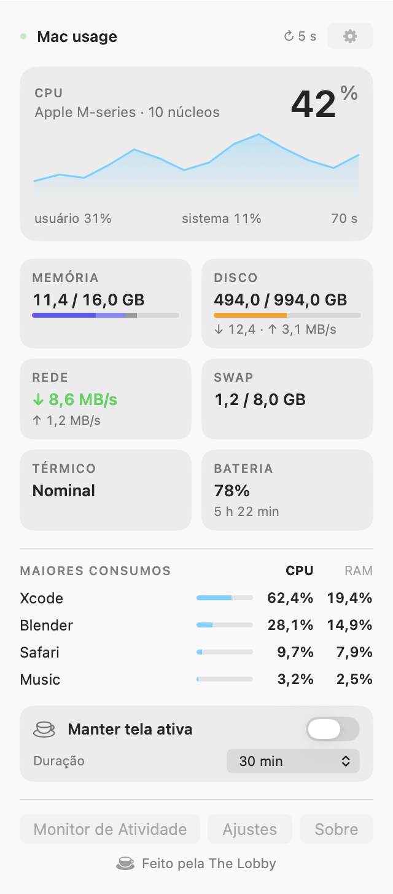
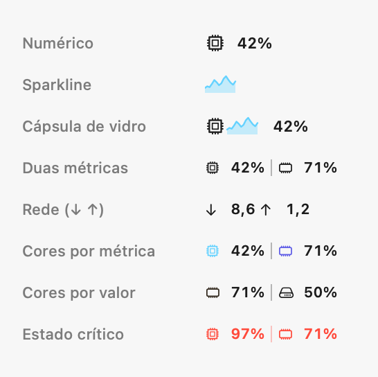
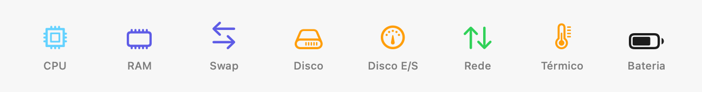

# ⚡ Mac usage

<p align="center">
  <strong>Monitor de recursos nativo, ultraleve e elegante para a barra de menu do macOS.</strong><br>
  <em>Construído em Swift puro com AppKit + SwiftUI — sem Electron, sem consumo desnecessário de bateria.</em>
</p>

<p align="center">
  
  
  
  
  
  
</p>

<p align="center">
  <picture>
    <source media="(prefers-color-scheme: dark)" srcset="Docs/panel-dark.png">
    
  </picture>
</p>

<p align="center">
  <sub>O painel completo, aberto com um clique na barra de menu. <em>Valores de exemplo.</em></sub>
</p>

---

## 📑 Sumário

- [Visão Geral](#-visão-geral)
- [Por que o Mac usage?](#-por-que-o-mac-usage)
- [Recursos Principais](#-recursos-principais)
  - [1. Barra de Menu Customizável](#1-barra-de-menu-customizável)
  - [2. Painel Detalhado (Popover)](#2-painel-detalhado-popover)
  - [3. Manter Tela Ativa (Keep Awake)](#3-manter-tela-ativa-keep-awake)
  - [4. Alertas Inteligentes de Sobrecarga](#4-alertas-inteligentes-de-sobrecarga)
- [Métricas Monitoradas](#-métricas-monitoradas)
- [Personalização & Ajustes](#-personalização--ajustes)
- [Como Instalar e Compilar](#-como-instalar-e-compilar)
- [Transparência & APIs Nativas](#-transparência--apis-nativas)
- [Estrutura do Projeto](#-estrutura-do-projeto)
- [Créditos e Licença](#-créditos-e-licença)

---

## 🌟 Visão Geral

O **Mac usage** é um aplicativo de barra de menu para macOS projetado para monitorar métricas vitais do sistema (CPU, memória RAM, swap, disco, rede, estado térmico e bateria) com consumo próximo de zero de recursos.

Ao contrário de alternativas baseadas em Electron ou scripts periódicos pesados, o Mac usage conecta-se diretamente às APIs nativas de baixo nível do kernel do macOS (`Mach`, `libproc` e `IOKit`), oferecendo precisão em tempo real sem prejudicar o desempenho do seu Mac.

---

## ✨ Por que o Mac usage?

| Diferencial | Mac usage ⚡ | Monitores Convencionais (Electron / CLI) 🐢 |
| :--- | :--- | :--- |
| **Tecnologia** | **Swift nativo puro (AppKit + SwiftUI)** | Wrappers web pesados (Chromium / Node.js) |
| **Consumo de Memória** | **Apenas alguns megabytes** | 150 MB a 400 MB+ de RAM |
| **Coleta de Métricas** | **Mach / libproc / IOKit diretos** | Disparo constante de subprocessos (`ps`, `top`) |
| **Amostragem Inteligente** | **Modo repouso (5s) quando fechado** | Taxa fixa agressiva que drena bateria |
| **Design do macOS** | **Liquid Glass nativo (macOS 26+) & Blur** | Interfaces web não integradas ao sistema |
| **Idiomas** | **Português (Brasil) e Inglês nativos** | Geralmente apenas em inglês |

---

## 🎯 Recursos Principais

### 1. Barra de Menu Customizável

<p align="center">
  <picture>
    <source media="(prefers-color-scheme: dark)" srcset="Docs/menu-bar-dark.png">
    
  </picture>
</p>

<p align="center">
  <sub>Cada linha é a imagem que o app realmente desenha na barra — gerada pelo próprio código de renderização.</sub>
</p>
- **Slots Flexíveis**: Escolha de 1 a 2 métricas prioritárias para exibição direta na barra.
- **Estilos de Ícone**:
  - `Numérico`: Leitura limpa e direta com tipografia monospaçada.
  - `Sparkline`: Mini-gráfico de linha com tendência recente (CPU).
  - `Cápsula de Vidro`: Efeito moderno de cápsula translúcida integrada ao macOS.
- **Modos de Cores**:
  - *Neutro*: Branco/preto adaptativo ao tema do sistema.
  - *Uma cor por métrica*: Identificação visual rápida por tonalidade.
  - *Muda com o uso*: Transição dinâmica de cor (verde → laranja → vermelho) conforme a carga sobe.
- **Tooltips Vivos**: Passe o mouse sobre o ícone para ver detalhes instantâneos sem precisar abrir o painel.

### 2. Painel Detalhado (Popover)
Clique em qualquer métrica na barra de menu para abrir um painel completo com visual moderno:
- **Gráfico de CPU**: Histórico de uso em tempo real, modelo do processador e contagem de núcleos.
- **Detalhamento de Memória**: Distribuição clara entre memória Ativa, Presa (*Wired*), Comprimida e Swap.
- **Armazenamento e Disco**: Espaço livre/usado e taxa de leitura/gravação em tempo real (MB/s).
- **Tráfego de Rede**: Velocidade instantânea de Download e Upload (MB/s).
- **Processos Mais Pesados**: Lista classificada ao vivo dos aplicativos que mais consomem CPU e RAM.

### 3. Manter Tela Ativa (Keep Awake) ☕
- Ícone dedicado de xícara de café na barra de status.
- Impede que a tela do Mac apague ou entre em repouso durante tarefas longas.
- Temporizador com durações pré-definidas (**15 min, 30 min, 1h, 2h, 4h**) ou **até desativar**.
- Substitui aplicativos adicionais como Caffeine ou Amphetamine.

### 4. Alertas Inteligentes de Sobrecarga 🚨
- Detecta quando a CPU permanece acima de **90%** por **10 segundos seguidos** — medido em tempo, não em número de leituras, então o alerta acende no mesmo momento com o painel aberto ou fechado.
- Ativa um estado visual crítico com indicador pulsante e alerta no cabeçalho.
- Inclui mecanismo de *histerese* para evitar que o alerta fique piscando em variações rápidas na borda do limite.

---

## 📊 Métricas Monitoradas

<p align="center">
  <picture>
    <source media="(prefers-color-scheme: dark)" srcset="Docs/icon-family-dark.png">
    
  </picture>
</p>

| Métrica | Ícone | O que exibe | Fonte de Dados |
| :--- | :---: | :--- | :--- |
| **CPU** | ⚡ | % de uso total, divisão Usuário/Sistema, histórico recente | `host_processor_info` (Mach) |
| **RAM** | 🧠 | Memória usada, ativa, presa, comprimida e total | `host_statistics64` (Mach) |
| **Swap** | 🔄 | Espaço de paginação utilizado e total | `sysctl` (`vm.swapusage`) |
| **Disco** | 💾 | Espaço ocupado e livre na partição raiz | `statfs` |
| **E/S Disco** | ⚡💾 | Taxa de leitura e gravação em tempo real (MB/s) | `IOKit` / `IOBlockStorageDriver` |
| **Rede** | 🌐 | Taxas de Download e Upload em tempo real (MB/s) | `getifaddrs` (`if_data64`) |
| **Térmico** | 🌡️ | Estado térmico (Nominal, Razoável, Sério, Crítico) | `ProcessInfo.thermalState` |
| **Bateria** | 🔋 | Nível de carga %, estado de recarga e tempo restante | `IOPMPowerSource` (IOKit) |
| **Processos** | 📋 | Top processos por consumo de CPU e Memória | `libproc` (`proc_pidinfo`) |

---

## ⚙️ Personalização & Ajustes

Abra a janela de Ajustes clicando no ícone de engrenagem no rodapé do painel:

```
┌─────────────────┬──────────────────┬─────────────────┐
│      Geral      │  Barra de menu   │      Painel     │
└─────────────────┴──────────────────┴─────────────────┘
```

1. **Geral**:
   - Duração padrão da função Manter Tela Ativa.
   - Alternância de idioma instantânea (**Português do Brasil** ou **English**).
   - Iniciar automaticamente com o login do sistema (via API moderna `SMAppService`).
2. **Barra de Menu**:
   - Arraste e solte para reordenar a prioridade das métricas.
   - Defina quantas métricas aparecem na barra (1 ou 2).
   - Escolha o modo de cor dos ícones e a cor de destaque da interface (Ciano, Azul, Verde ou Roxo).
   - Escolha o estilo do ícone (Numérico, Sparkline ou Cápsula de vidro).
3. **Painel**:
   - Reorganize a ordem das seções do painel via *drag-and-drop*.
   - Ajuste o intervalo de amostragem (**1s, 2s ou 5s**).
   - Ative ou oculte a seção de maiores consumidores (Top Processos).

---

## 🚀 Como Instalar e Compilar

### Pré-requisitos
- **macOS 14.0 (Sonoma)** ou superior *(Efeito Liquid Glass otimizado para macOS 26+)*
- **Xcode** ou **Swift Command Line Tools** (`swift --version` >= 5.9)

### Compilação do Aplicativo (.app)

Clone o repositório e execute o script de empacotamento:

```bash
# 1. Acesse o diretório do projeto
cd "Mac usage/SystemMonitor"

# 2. Compile e empacote o aplicativo (Release)
./Scripts/build_app.sh

# 3. Abra o aplicativo gerado
open "Mac usage.app"
```

> [!TIP]
> O script `build_app.sh` compila em modo Release, gera automaticamente os ícones de alta resolução (`.icns`), empacota o `Mac usage.app` e aplica a assinatura de código ad-hoc para execução perfeita no Gatekeeper local.

### Desenvolvimento e Execução Rápida

Para testar alterações rapidamente sem precisar reempacotar o `.app`:

```bash
swift build && .build/debug/SystemMonitor
```

### Testes

```bash
swift test
```

### Imagens desta documentação

As imagens acima não são montagens: são desenhadas pelo próprio código de
renderização do app (`StatusItemContentRenderer`, `MetricIconLibrary` e a
`PanelView` real), a partir de uma amostra fixa, para que continuem fiéis ao
que a versão atual desenha. Para regerá-las:

```bash
README_ASSETS_DIR=Docs swift test --filter ReadmeAssetTests
```

---

## 🔒 Transparência & APIs Nativas

- **Temperatura da CPU em °C**: A leitura direta de sensores do SMC via `IOConnectCallStructMethod` retorna `kIOReturnNotPrivileged` para aplicativos de terceiros no macOS moderno sem *entitlements* privados restritos da Apple. Em vez de utilizar hacks não confiáveis, o Mac usage utiliza a API pública oficial `ProcessInfo.thermalState` (Nominal, Razoável, Sério, Crítico).
- **Uso de GPU**: A telemetria contínua de GPU no Apple Silicon exige privilégios de `root` (`powermetrics`). O Mac usage mantém-se estritamente seguro e não requer permissões elevadas de administrador.
- **Segurança de Login**: O início automático com o sistema é gerenciado via `SMAppService.mainApp` — a tecnologia recomendada pela Apple que substitui os obsoletos *Legacy Login Items*.

---

## 📂 Estrutura do Projeto

```
SystemMonitor/
├── Package.swift               # Manifesto do Swift Package Manager
├── Scripts/
│   ├── build_app.sh            # Script de build e empacotamento do .app
│   ├── build_icon.sh           # Script de geração do arquivo AppIcon.icns
│   └── generate_app_icon.swift # Gerador vetorial programático do ícone
├── Resources/
│   ├── Info.plist              # Configurações do bundle (LSUIElement / sem Dock)
│   ├── AppIcon.icns            # Ícone do aplicativo em alta resolução
│   └── lobby-mark.svg          # Identidade visual The Lobby
├── Docs/                       # Imagens do README, geradas pelo próprio app
├── Tests/SystemMonitorTests/   # Testes (lógica pura + geração das imagens)
└── Sources/SystemMonitor/
    ├── App/                    # Ponto de entrada (NSApplicationDelegate, NSStatusItem)
    ├── Metrics/                # Samplers de baixo nível (CPU, RAM, Disco, Rede, Bateria, etc.)
    │   └── SystemMetricsEngine # Timer serial e orquestrador de métricas
    ├── MenuBar/                # Renderização dos ícones, tooltips e estilos na barra
    ├── Panel/                  # Interface SwiftUI do painel popover e gráficos
    ├── Settings/               # Interface de preferências (Ajustes com 3 abas)
    ├── Model/                  # Persistência de configurações (AppSettings)
    ├── About/                  # Janela "Sobre o Mac usage"
    └── Support/                # Utilitários de cor, formato, l10n e KeepAwake
```

---

## 📄 Créditos e Licença

Desenvolvido por **[The Lobby](https://thelobby.com.br)** / **Estevão Fonseca**.

Distribuído sob a licença **GPLv3**. Consulte o arquivo [LICENSE](LICENSE) para mais informações.
